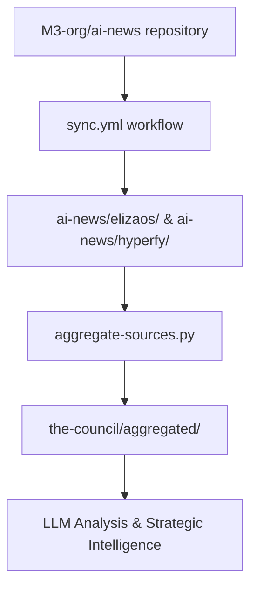

# AI News - Multi-Source Intelligence

**Curated AI news and updates from multiple specialized sources.**

This directory serves as a comprehensive collection of AI-related news, developments, and community discussions from various specialized sources, providing diverse perspectives on the AI ecosystem for strategic analysis.

## Purpose

The `ai-news/` directory aggregates AI intelligence from multiple curated sources to provide comprehensive coverage of industry developments, technical breakthroughs, and community insights. This data feeds into the elizaOS knowledge pipeline for strategic analysis and trend identification.

## Directory Structure

### Source Categories

#### `elizaos/` - ElizaOS Ecosystem News
**Primary focus: ElizaOS project developments and related AI agent news**

**Subdirectories:**
- `json/` - Structured daily summaries (2024-10-25 to present, 270+ files)
- `md/` - Human-readable daily reports (2024-10-25 to present, 268+ files) 
- `discord/` - Discord community discussions
  - `json/` - Structured Discord data (2025-01-01 to present, 205+ files)
  - `md/` - Discord discussion summaries (limited coverage)
- `dev/` - Development-focused content
  - `json/` - Developer news data (2025-01-01 to present, 158+ files)
  - `md/` - Developer reports (2025-01-01 to present, 158+ files)
- `daily.json` - Permalink to latest aggregated data

#### `hyperfy/` - Hyperfy VR/Web3 Platform News  
**Secondary focus: VR, Web3, and metaverse developments**

**Subdirectories:**
- `json/` - Structured daily summaries (2025-01-01 to present, 153+ files)
- `md/` - Human-readable daily reports (2025-01-01 to present, 153+ files)

## Data Characteristics

### Content Coverage
- **ElizaOS Ecosystem**: Agent development, framework updates, community discussions
- **Discord Analysis**: Community sentiment, technical discussions, user feedback
- **Development News**: Technical breakthroughs, framework releases, integration updates
- **Hyperfy Platform**: VR development, Web3 integration, metaverse applications

### File Formats

#### JSON Files (`*.json`)
- **Structure**: Standardized daily summary format
- **Content**: 
  - GitHub activity summaries
  - Pull requests and issues
  - Community discussions
  - Technical developments
- **Size**: Typically 5-15KB per file
- **Usage**: Machine-readable data for automated processing

#### Markdown Files (`*.md`)
- **Structure**: Human-readable daily reports
- **Content**:
  - Formatted summaries with headers
  - GitHub activity with links
  - Issue tracking and resolution
  - Community highlights
- **Size**: Typically 2-8KB per file  
- **Usage**: Human review and poster generation

### Data Volume Analysis
- **Total Files**: 1,640+ files (818 MD + 822 JSON)
- **Date Range**: October 2024 to present (9+ months)
- **Growth Rate**: ~6 files per day across all sources
- **Storage**: Approximately 15-20MB total

## Data Sources & Synchronization

### External Sync Process
- **Source Repository**: `M3-org/ai-news` (gh-pages branch)
- **Sync Schedule**: Daily at 01:00 UTC via `.github/workflows/sync.yml`
- **Sync Method**: `rsync` from external repository to local directories
- **Target Directories**: `ai-news/elizaos/` and `ai-news/hyperfy/`

### Content Generation Pipeline
- **External Processing**: Content processed and structured by M3-org/ai-news
- **Local Integration**: Synced data consumed by `scripts/aggregate-sources.py`
- **Downstream Usage**: Facts extraction, council briefings, poster generation

## Integration with Knowledge Pipeline

### Data Flow


### HackMD Integration
- **ElizaOS Main**: https://hackmd.io/7qL57ABlR56VEKZfyVWS6Q (ai-news/elizaos/md/)
- **ElizaOS Dev**: https://hackmd.io/sJlY8NNLR76UaOAojMkqig (ai-news/elizaos/dev/md/)
- **ElizaOS Discord**: https://hackmd.io/Z3qVBdvRQJ-WuaS-n_L_ZQ (ai-news/elizaos/discord/md/)
- **Configuration**: Managed via `book.json` CUSTOM_HEADER_LINKS
- **Sync Method**: Direct file sync from respective `md/` directories

### Processing Integration
- **Primary Consumer**: `scripts/aggregate-sources.py`
- **Data Keys**: `ai_news_elizaos_*`, `ai_news_hyperfy_*`
- **Processing Schedule**: Daily aggregation at 01:30 UTC
- **Output**: Integrated into `the-council/aggregated/YYYY-MM-DD.json`

## Content Categories

### GitHub Activity Tracking
- **Pull Requests**: Status, authors, significance analysis
- **Issues**: Creation, resolution, community engagement
- **Releases**: Version updates, feature announcements
- **Contributors**: Activity patterns, community growth

### Community Intelligence
- **Discord Discussions**: Technical debates, user feedback, sentiment
- **Development Trends**: Framework evolution, plugin development
- **Strategic Insights**: Market positioning, competitive analysis
- **User Experience**: Pain points, feature requests, success stories

### Technical Developments
- **Framework Updates**: Core improvements, breaking changes
- **Plugin Ecosystem**: New integrations, community contributions
- **Infrastructure**: Deployment, scaling, performance improvements
- **Documentation**: Guides, tutorials, API references

## Usage Examples

### Access Latest News
```bash
# View latest ElizaOS news
cat ai-news/elizaos/md/$(ls ai-news/elizaos/md/ | grep -E '^2025-' | sort | tail -1)

# View latest Hyperfy updates  
cat ai-news/hyperfy/md/$(ls ai-news/hyperfy/md/ | sort | tail -1)

# Check Discord community activity
cat ai-news/elizaos/discord/md/$(ls ai-news/elizaos/discord/md/ | sort | tail -1)
```

### Data Analysis
```bash
# Search for specific topics
grep -r "plugin" ai-news/elizaos/md/ | tail -10
grep -r "Discord" ai-news/elizaos/md/ | head -5

# Track GitHub activity trends
find ai-news/elizaos/json/ -name "2025-07-*.json" -exec grep -l "pull_request" {} \;

# Monitor community sentiment
grep -r "community" ai-news/elizaos/discord/md/ | wc -l
```

### File Statistics
```bash
# Count files by source
ls ai-news/elizaos/md/ | wc -l
ls ai-news/hyperfy/md/ | wc -l

# Find latest updates
ls -la ai-news/elizaos/md/ | tail -5
```

## Data Quality & Validation

### Content Standards
- **Consistency**: Standardized JSON schema across sources
- **Completeness**: Daily coverage with minimal gaps
- **Accuracy**: Source attribution and link verification
- **Timeliness**: 24-hour processing latency

### Monitoring & Health Checks
- **Sync Status**: GitHub Actions workflow success tracking
- **File Completeness**: Daily file count validation
- **Content Quality**: JSON schema validation
- **Link Integrity**: Source URL accessibility

## Historical Context

### Timeline Evolution
- **2024-10-25**: ElizaOS news tracking begins
- **2025-01-01**: Hyperfy coverage added, Discord tracking enhanced
- **2025-01-01**: Developer-focused content stream added
- **Current Status**: Multi-source comprehensive coverage

### Coverage Expansion
- **Initial Focus**: Basic GitHub activity tracking
- **Community Integration**: Discord analysis and sentiment tracking
- **Developer Experience**: Technical deep-dives and development trends
- **Strategic Intelligence**: Market analysis and competitive positioning

## Troubleshooting

### Common Issues
- **Sync Failures**: Check M3-org/ai-news repository status
- **Missing Files**: Verify sync.yml workflow completion
- **Data Gaps**: Check external source availability
- **Format Inconsistencies**: Validate against JSON schema

### Recovery Procedures
- **Manual Sync**: Trigger sync.yml workflow manually
- **Data Validation**: Use `jq` to validate JSON structure
- **Source Verification**: Check M3-org/ai-news gh-pages branch
- **Pipeline Health**: Monitor aggregate-sources.py processing

## Contributing & Maintenance

### External Dependencies
- **Source Repository**: M3-org/ai-news (external maintenance)
- **Sync Infrastructure**: GitHub Actions workflows
- **Processing Scripts**: aggregate-sources.py compatibility
- **HackMD Integration**: book.json configuration management

### Local Modifications
- Files are automatically synchronized and should not be edited locally
- Changes to sync configuration should be made in sync.yml
- Integration modifications should be made in aggregate-sources.py
- HackMD mappings managed via book.json updates

---

*This directory is automatically synchronized from external sources. Local modifications will be overwritten during the next sync cycle.*