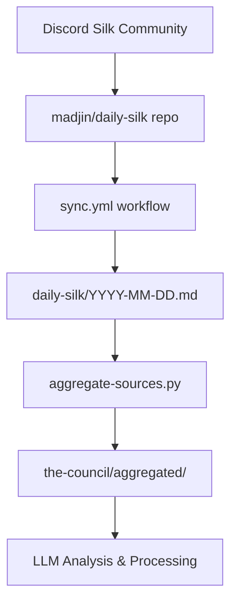

# Daily Silk - AI News Data

**Daily AI news and trends aggregated from Discord's "Silk" community.**

This directory contains daily aggregated AI news summaries collected from Discord discussions, providing a continuous stream of AI industry developments, trends, and community insights.

## Purpose

The `daily-silk/` directory serves as a critical data source for the elizaOS knowledge system, capturing daily AI news, product releases, research developments, and community trends. This data feeds into the broader intelligence pipeline for analysis and strategic insights.

## Data Source

- **Origin**: Synced from the [`madjin/daily-silk`](https://github.com/madjin/daily-silk) repository
- **Sync Schedule**: Daily at 01:00 UTC via `.github/workflows/sync.yml`
- **Community**: AI-focused Discord community discussions
- **Coverage**: Global AI news, product launches, research papers, and trend analysis

## Directory Structure

### File Organization
- **Naming Convention**: `YYYY-MM-DD.md` (ISO 8601 date format)
- **Date Range**: 2025-01-09 to present (currently 167+ files)
- **File Format**: Markdown with structured sections
- **Total Content**: ~25,000+ lines of aggregated AI news

### Content Structure

Each daily file typically contains:

```markdown
# Daily Summary for YYYY-MM-DD

## YYYY-MM-DD HH:MM:SS

# DAILY AI NEWS

## QUARTER HOUR AI NEWS SUMMARY

### Most Notable Summary of the Hour:
- Key developments and major announcements

### Interesting Products, Services, Research Papers, and/or GitHub Repos:
- New tools, services, and research releases

### Opinions & Trends Forming Around Current Events:
- Community discussions and trend analysis
```

## Content Categories

### Major News & Developments
- **Industry Announcements**: Major AI company updates and strategic moves
- **Policy & Regulation**: Government AI policies and regulatory changes
- **Market Developments**: AI market trends, funding, and business developments
- **Technical Breakthroughs**: Research achievements and technological advances

### Product & Service Releases
- **AI Tools**: New applications, services, and platforms
- **Open Source Projects**: GitHub repositories and community tools
- **APIs & SDKs**: Developer tools and integration services
- **Research Papers**: Academic publications and technical papers

### Community Insights & Trends
- **Opinion Analysis**: Community sentiment and expert perspectives
- **Future Predictions**: Trend forecasting and strategic analysis
- **Debate Topics**: Controversial issues and discussion points
- **Adoption Patterns**: Usage trends and community adoption

## Integration with Knowledge Pipeline

### Data Flow


### Processing Integration
- **Primary Consumer**: `scripts/aggregate-sources.py`
- **Processing Time**: Daily aggregation at 01:30 UTC
- **Output Integration**: Feeds into `the-council/aggregated/YYYY-MM-DD.json`
- **Downstream Usage**: Facts extraction, council briefings, Discord notifications

### HackMD Synchronization
- **HackMD Note**: "AI News X (SILK)" - https://hackmd.io/qOsHc4lPQTSPDVy8864o2Q
- **Sync Method**: Direct file sync from `daily-silk/` directory
- **Configuration**: Managed via `book.json` CUSTOM_HEADER_LINKS
- **Update Frequency**: Daily via `update-hackmd.py`

## File Format Details

### Markdown Structure
- **Headers**: Structured hierarchy with date/time stamps
- **Links**: Source links to original tweets, articles, and repositories
- **Categorization**: Content organized by news type and significance
- **Timestamps**: Multiple entries per day with precise timing

### Content Quality
- **Source Attribution**: Links to original sources (Twitter, research papers, GitHub)
- **Trend Analysis**: Community-driven insights and opinion synthesis
- **Technical Depth**: Coverage ranges from high-level news to technical details
- **Real-time Updates**: Multiple updates throughout each day

## Data Characteristics

### Coverage Scope
- **Global Perspective**: International AI developments and announcements
- **Multi-Platform**: Twitter, GitHub, research institutions, tech companies
- **Diverse Sources**: Industry leaders, researchers, community developers
- **Real-time Tracking**: Hour-by-hour updates on major developments

### Content Volume
- **Average File Size**: ~150 lines per daily file
- **Update Frequency**: Multiple updates per day (every 4 hours typically)
- **Growth Rate**: ~1 file per day, continuous accumulation
- **Historical Depth**: 6+ months of continuous coverage

## Usage Examples

### View Latest AI News
```bash
# Read today's AI news
cat daily-silk/$(date +%Y-%m-%d).md

# View recent files
ls -la daily-silk/ | tail -10

# Search for specific topics
grep -r "GPT" daily-silk/ | tail -5
grep -r "research paper" daily-silk/ | head -10
```

### Data Analysis
```bash
# Count total news entries
wc -l daily-silk/*.md

# Find trending topics
grep -h "###" daily-silk/2025-07-*.md | sort | uniq -c | sort -nr

# Track specific companies
grep -r "OpenAI\|Google\|Microsoft" daily-silk/2025-07-*.md
```

## Quality Assurance

### Data Validation
- **Source Verification**: Links to original sources included
- **Date Consistency**: Files follow strict YYYY-MM-DD naming
- **Content Structure**: Consistent markdown formatting
- **Update Frequency**: Regular daily updates confirmed

### Processing Reliability
- **Sync Monitoring**: GitHub Actions workflow success tracking
- **Content Freshness**: Latest files within 24 hours
- **Integration Health**: Successful aggregation into downstream processing
- **Error Handling**: Graceful handling of missing or malformed files

## Troubleshooting

### Common Issues
- **Missing Daily Files**: Check sync.yml workflow status
- **Stale Content**: Verify madjin/daily-silk repository updates
- **Processing Errors**: Ensure file format consistency
- **Integration Failures**: Check aggregate-sources.py compatibility

### Data Recovery
- **Source Repository**: https://github.com/madjin/daily-silk
- **Backup Strategy**: Historical files preserved in git history
- **Manual Sync**: Can manually trigger sync.yml workflow
- **Alternative Sources**: Discord community for manual collection

## Historical Context

### Timeline
- **Start Date**: 2025-01-09 (first recorded daily summary)
- **Current Status**: Active daily collection (as of 2025-07-24)
- **Milestone Events**: Captured major AI announcements, policy changes, product launches

### Evolution
- **Format Refinement**: Consistent structure development over time
- **Content Expansion**: Broader coverage and deeper analysis
- **Integration Maturity**: Seamless pipeline integration achieved
- **Community Growth**: Expanding source network and contributor base

---

*This directory is automatically synchronized from the madjin/daily-silk repository. Local modifications will be overwritten during the next sync cycle.*