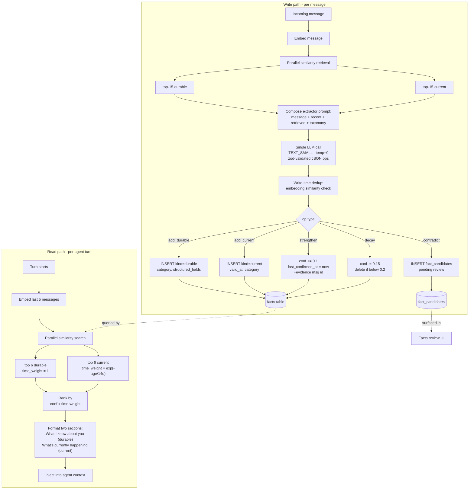

# Fact Memory: Durable + Current Facts

## Goal

Replace the current single-store, regex-filtered fact extraction with a two-store system: **durable** identity-level facts and **current** time-weighted state facts. A single LLM call per message handles both extraction and reconciliation. The read path retrieves top-K of each store independently, applying time weighting only to current facts.

This follows the Generative Agents (Park et al., 2023) pattern: vector relevance + recency, retrieved separately by store. **No promotion mechanic** — durable and current are distinct kinds, retrieved with different weighting curves. Stale current facts naturally fade via the time-weight curve; explicit closures emit new current facts that supersede via similarity.

## Type model

### `durable` facts
Stable claims about who someone is and persistent context.

| Category | Example |
|---|---|
| `identity` | "lives in Berlin", "born 1990", "preferred name is Sam" |
| `health` | "flat cortisol curve confirmed via lab", "allergic to penicillin", "always struggles in mornings" |
| `relationship` | "has a sister Mia", "married to Alex" |
| `life_event` | "founded $company in 2024", "moved to Berlin in 2023" |
| `business_role` | "senior engineer at $company since 2024" |
| `preference` | "prefers concise answers", "dislikes group calls" |
| `goal` | "wants to launch indie product by 2027" |

**Time weighting in retrieval: none.** Score = `confidence × relevance`.

### `current` facts
Time-bound claims about state right now.

| Category | Example |
|---|---|
| `feeling` | "anxious this morning" |
| `physical_state` | "low energy this week", "headache today" |
| `working_on` | "debugging auth flow", "drafting Q4 plan" |
| `going_through` | "navigating divorce", "recovering from surgery" |
| `schedule_context` | "traveling to Tokyo next week", "deadline Friday" |

**Time weighting in retrieval: curved decay.** Default `exp(-age_days / 14)`. Today/this week is near-full weight; 14d ≈ 50%; 30d ≈ 14%; below that, weight is small but non-zero. **No hard cutoff** — month-old current facts can still surface if relevance is high enough.

### Shared metadata
Both kinds carry: `kind`, `category`, `structured_fields`, `confidence`, `evidence_message_ids[]`, `verification_status` (`self_reported | confirmed | contradicted`), `created_at`, `last_confirmed_at`. Current additionally carries `valid_at` (when state began).

## Extraction pipeline (per message)

Single LLM call. No separate refinement pass.

1. Embed incoming message
2. Parallel similarity retrieval: top-15 durable + top-15 current (so the model sees what already exists and won't duplicate)
3. Compose extractor prompt: message + recent context + retrieved facts/states + category taxonomy + dedup instructions
4. **One LLM call** — `TEXT_SMALL`, `temp=0`, zod-validated JSON output
5. Apply ops to DB

### Operations

| op | effect |
|---|---|
| `add_durable` | INSERT `kind=durable`, category, structured_fields, conf=0.7 |
| `add_current` | INSERT `kind=current`, valid_at=now, category, conf=0.7 |
| `strengthen` | conf += 0.1, last_confirmed_at = now, append evidence msg id |
| `decay` | conf −= 0.15; delete if below 0.2 |
| `contradict` | INSERT `fact_candidates` (pending review) |
| implicit no-op | model omits → no change |

**Dropped operations:** `promote_to_durable`, `retire_current`. Stale current facts age out via time weight; explicit closure ("I fixed the bug") emits a new current fact ("auth bug fixed Apr 25") that supersedes via similarity.

## Avoiding double extraction

Three layers:

1. **Pre-filter retrieval at extraction.** The model sees existing similar facts/states in its prompt context and is instructed to emit `strengthen` (not `add_*`) when a match exists.
2. **Prompt instruction.** Explicit dedup rule: "If a similar claim already exists in the retrieved facts, emit `strengthen` with that fact's id. Do not duplicate."
3. **Write-time embedding check.** Before INSERT, embed the proposed claim and check cosine similarity against existing facts in the same `kind` + `category`. If ≥ 0.92, upgrade `add_*` → `strengthen` automatically.

## Read path (provider, per turn)

1. Embed last 5 messages
2. Two parallel similarity searches: top 6 durable + top 6 current
3. Optional: BM25 rerank for lexical matches (deferred to v2)
4. Rank: `confidence × time_weight(kind, age)`
   - Durable: `time_weight = 1` (no decay)
   - Current: `time_weight = exp(-age_days / 14)` — ~50% at 14d, ~14% at 30d, never zero
5. Format two prompt sections with kind/category prefix:
   - **What I know about you** (durable)
   - **What's currently happening for you** (current, with `since <date>`)

## Mermaid

## Files affected

| File | Change |
|---|---|
| `eliza/packages/core/src/types/memory.ts` | Extend fact metadata: `kind`, `category`, `structured_fields`, `valid_at`, `last_confirmed_at`, `verification_status` |
| `eliza/packages/core/src/features/advanced-capabilities/providers/facts.ts` | Split retrieval into durable + current; per-kind time weight; two-section formatted output |
| `eliza/packages/core/src/features/advanced-capabilities/evaluators/reflection-items.ts` | Register atomic evaluator items for facts, relationships, identities, and task success |
| `eliza/packages/core/src/features/advanced-capabilities/evaluators/factRefinement.ts` | **DELETE** — folded into the fact-memory evaluator processor |
| New: `eliza/packages/core/src/features/advanced-capabilities/evaluators/factExtractor.schema.ts` | Schema for ops + category taxonomy enums |
| `eliza/packages/core/src/services/evaluator.ts` | Merge active evaluator schemas and prompts into one structured post-turn model call |
| Plugin registration site | Register `factMemoryEvaluator`, `relationshipEvaluator`, `identityEvaluator`, and `successEvaluator` through the evaluator registry |
| Migration | Lazy reclassification: untouched legacy facts default to `kind=durable`, `category=uncategorized` |

## Tests

All tests use real pglite via `@elizaos/plugin-sql` — no SQL mocks (per project convention).

### Categorization scenarios
- "I have a flat cortisol curve confirmed via lab" → `durable.health` with `{verification_status: confirmed, source: test}`
- "I'm anxious this morning" → `current.feeling`
- "I moved to Berlin last March" → `durable.life_event` (with date) + `durable.identity` location update
- "Currently debugging the auth flow" → `current.working_on`
- "Going through a divorce" → `current.going_through`
- "Founded $company in 2024" → `durable.life_event` + `durable.business_role`
- "Allergic to penicillin" → `durable.health`
- "Today's been rough" → `current.feeling` (not durable)
- "I always struggle with mornings" → `durable.health` with `{pattern: recurring}`

### Dedup scenarios
- Same claim phrased differently across two messages → second emits `strengthen`, not `add_*`
- Same claim reworded with synonyms → write-time embedding check catches it
- New current update about same `going_through` situation → `strengthen` not duplicate

### Time-weighting scenarios
- Current fact 1 day old → near-full weight in retrieval
- Current fact 14 days old → ~50% weight
- Current fact 30 days old → ~14% weight (still retrievable when relevance is high)
- Durable fact 30 days old → full weight (no decay)
- Durable fact 1 year old → full weight (no decay)

### Strengthen / contradict
- User reaffirms existing durable fact → confidence increases
- User contradicts durable fact ("actually I moved to Tokyo") → INSERT fact_candidates
- User updates current fact ("fixed the auth bug") → new current fact supersedes via similarity; old one ages out

### Provider blending
- Mixed durable + current present → both sections appear with correct prefixes
- Empty current store → only durable section
- Provider output stable when called twice in same turn (deterministic ranking)

## Decisions to flag during implementation

- **Categorization edge cases:** "always struggles with mornings" → `durable.health` with `pattern: recurring` vs `durable.preference`. Pick one and document.
- **Embedding similarity threshold for write-time dedup:** start 0.92, tune from logs.
- **Time-weight curve:** `exp(-age_days/14)` is a default. Alternatives: piecewise linear, sigmoid. Curve choice matters less than not having a hard cutoff.
- **BM25 rerank:** deferred to v2. Vector + time weight first.
- **Migration:** lazy reclassification on next mention is safer than batch backfill. Untouched legacy facts stay `durable.uncategorized`.

## References

- Generative Agents: Park et al., 2023 — vector + recency + importance scoring with separate memory streams; informs the two-store + time-weight pattern here
- Honcho (referenced in current `factRefinement.ts` header) — dialectic refinement pattern; we're absorbing it into the single-call extractor
