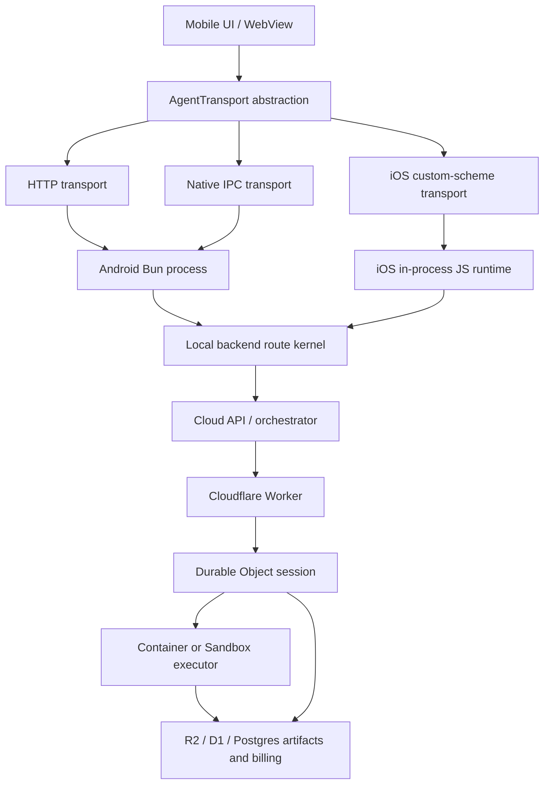

# On-device mobile agent and cloud executor assessment

Date: 2026-05-04

## Executive summary

Running the whole agent locally on Android is already partially built. Running the whole agent locally on App Store iOS is a fundamentally different effort and should be treated as a high-risk architecture program, not a mobile packaging task.

The pragmatic path is:

1. Harden Android immediately: keep the existing local agent service, wire the per-boot token into the WebView/native bridge, and enable `ELIZA_REQUIRE_LOCAL_AUTH=1`.
2. Introduce an explicit `AgentTransport` abstraction in the frontend client so HTTP, native IPC, and later WebView custom-scheme requests can share one call surface.
3. Extract the backend route kernel from Node `http.IncomingMessage` / `ServerResponse` toward Fetch `Request -> Response`. This is the enabling step for real IPC and any future iOS in-process backend.
4. Ship iOS as cloud or cloud-hybrid first, using the existing `llama-cpp-capacitor` path for on-device inference. Do not promise a full local iOS agent until a reduced iOS backend proof of concept survives App Review/runtime constraints.
5. Build Cloudflare Containers/Sandboxes as a bursty cloud executor for Codex/Claude-style tools and repository work, billed through user credits/account linkage. This complements an on-device agent; it does not remove the need for local route/storage/runtime work.

Bottom line: Android local agent hardening is days to weeks. Cross-platform IPC is weeks. Full-parity iOS local backend is likely 4-6+ months with meaningful App Store and runtime risk.

## Current codebase reality

### Android already hosts a local agent

The Android app has an explicit bundled on-device endpoint:

- `packages/app-core/src/onboarding/mobile-runtime-mode.ts` defines `ANDROID_LOCAL_AGENT_API_BASE = "http://127.0.0.1:31337"`.
- `packages/app-core/src/onboarding/probe-local-agent.ts` probes `/api/health`, offers local mode only on Android/dev/desktop, and explicitly says iOS/plain web do not host a local agent.
- `packages/app-core/src/onboarding/pre-seed-local-runtime.ts` pre-seeds Android/AOSP fresh installs to the local runtime mode.

The native Android service owns the real process:

- `packages/app-core/platforms/android/app/src/main/java/ai/elizaos/app/ElizaAgentService.java` unpacks Bun, musl, shared libraries, the bundled agent JS, PGlite assets, plugins manifest, and optional GGUF models from APK assets into app-private storage.
- The same service starts Bun on port `31337`, health-checks `http://127.0.0.1:31337/api/health`, uses a watchdog, and gives AOSP builds special local llama settings.
- `packages/app-core/scripts/lib/stage-android-agent.mjs` stages Bun 1.3.13 musl binaries and Alpine runtime libraries into the APK assets tree.

This means Android is not a blank slate. The next Android decision is not "can we run an agent locally?" It is "how do we secure and abstract the current local HTTP transport?"

### Android has a known loopback security gap

`ElizaAgentService` already generates a per-boot token and sets `ELIZA_API_TOKEN`, but the critical `ELIZA_REQUIRE_LOCAL_AUTH=1` environment variable is commented out because the WebView token path is not wired yet:

```java
// agentEnv.put("ELIZA_REQUIRE_LOCAL_AUTH", "1");
agentEnv.put("ELIZA_API_TOKEN", token);
```

The upstream auth helper already supports the right server behavior. `packages/agent/src/api/server-helpers-auth.ts` explicitly says Android loopback is shared across apps and returns false from `isTrustedLocalRequest()` when `ELIZA_REQUIRE_LOCAL_AUTH=1`.

This should be treated as a P0 hardening task before expanding "local agent" beyond controlled AOSP builds. Android loopback is reachable from other apps on the device; `127.0.0.1` is not an app-private trust boundary.

### iOS does not currently host a local backend

iOS has the plugin shape but not the implementation:

- `packages/native-plugins/agent/ios/Sources/AgentPlugin/AgentPlugin.swift` is a stub with no methods and a comment saying the agent runs on a server and web handles HTTP.
- `packages/native-plugins/agent/src/web.ts` is a web fallback that uses HTTP to `window.__ELIZA_API_BASE__`.
- `packages/app-core/platforms/ios/App/Podfile` includes `LlamaCppCapacitor` and `ElizaosCapacitorAgent`, so iOS has native inference/plugin hooks, but not an embedded full backend.
- `packages/app-core/src/platform/ios-runtime.ts` models iOS modes as `remote-mac | cloud | cloud-hybrid | local`, but `local` is only a config shape today.

So "offer on-device as an option on iOS" needs a real native/runtime implementation, not just a UI flag.

### The API server is not Hono today

The main agent server is a Node HTTP server:

- `packages/agent/src/api/server.ts` calls `http.createServer(async (req, res) => handleRequest(req, res, state, ...))`.
- `packages/app-core/src/api/server.ts` monkey-patches `http.createServer` to add compat routes, CORS, and the local inference device-bridge WebSocket handler.
- Searching for Hono shows Hono only in examples/docs and a comment, not in the app/agent runtime server.

That matters for the IPC proposal. We should not plan around "wrap Hono" unless we first refactor the backend to a Fetch/Hono-compatible route kernel. The likely right abstraction is Fetch-shaped (`Request -> Response`) because it can be served by Node HTTP, Cloudflare Workers, Capacitor IPC, and `WKURLSchemeHandler`.

### Frontend has one good leverage point

`packages/app-core/src/api/client-base.ts` centralizes REST calls through `ElizaClient.rawRequest()`, which currently builds a URL and calls `fetch`. This is the right insertion point for:

- `HttpAgentTransport`
- `NativeAgentTransport`
- `CustomSchemeAgentTransport`
- streaming/event transport adapters

The existing WebSocket paths still need separate treatment, but the ordinary REST surface can be migrated without changing every caller.

### On-device inference exists separately from the backend

There are already multiple local inference paths:

- `packages/app-core/src/runtime/ensure-local-inference-handler.ts` chooses AOSP native FFI, Capacitor llama, device bridge, or desktop node-llama.
- `packages/native-plugins/llama/src/capacitor-llama-adapter.ts` wraps `llama-cpp-capacitor` for iOS/Android model load/generate/embed.
- `packages/app-core/src/runtime/mobile-local-inference-gate.ts` enables mobile local inference for `ELIZA_DEVICE_BRIDGE_ENABLED=1` or AOSP `ELIZA_LOCAL_LLAMA=1`.

This is valuable, but it is not the same as running the whole agent backend locally. The current iOS opportunity is "cloud backend with local inference option," not "full iOS backend parity."

## Platform constraints from research

### iOS App Store constraints

Apple App Review guideline 2.5.2 requires apps to be self-contained and forbids downloading/installing/executing code that introduces or changes app functionality. Educational-code exceptions are narrow. Guideline 2.5.4 limits background services to intended categories such as audio, VoIP, location, task completion, and notifications.

Implication:

- Shipping a bundled JS backend as app assets is more defensible than downloading agent/plugin code later.
- Arbitrary downloadable plugins/actions that execute locally on iOS are high App Review risk.
- A long-running always-on local agent in the background is also risky unless work is tied to approved background modes or short task completion.

`WKURLSchemeHandler` can handle custom schemes for WKWebView content, and `setURLSchemeHandler(_:forURLScheme:)` cannot be registered for schemes WebKit already handles such as `https`. So iOS IPC through WebView request routing should use a custom scheme such as `eliza-api://...` or a Capacitor plugin method, not `http://127.0.0.1`.

### Android IPC options

Android has two good protected transport options:

- Bound service / Binder IPC. Android's docs describe binding with `bindService()`, receiving an `IBinder`, and using Binder/Messenger/AIDL depending on process needs.
- `android.net.LocalSocket`, which creates AF_LOCAL/Unix-domain sockets.

For this app, Binder is usually simplest when the WebView/native plugin and service stay in the same app boundary. LocalSocket is closer to HTTP semantics and stream-friendly, but must be designed carefully with filesystem permissions, peer validation, and framing.

### Cloudflare Containers status

Cloudflare Containers and Sandboxes are generally available as of April 13, 2026. Containers are backed by Workers and Durable Objects; requests route Worker -> Durable Object -> container. End-users cannot make arbitrary inbound TCP/UDP requests directly to the container, but HTTP/WebSocket-style request forwarding fits agent workloads.

Pricing is attractive for bursty jobs:

- Included on Workers Paid: 25 GiB-hours memory, 375 vCPU-minutes, and 200 GB-hours disk monthly.
- Additional usage is billed by active running intervals, currently in 10 ms increments.
- Instance types range from `lite` at 1/16 vCPU, 256 MiB memory, 2 GB disk up to `standard-4` at 4 vCPU, 12 GiB memory, 20 GB disk.
- Memory and disk billing are based on provisioned resources while the instance is running; CPU billing is active usage.
- Requests go through Workers/Durable Objects, so those costs and limits also apply.

Operationally, Containers are a good match for:

- Codex/Claude headless subprocesses.
- Repository clone/build/test/edit tasks.
- Shell tools unavailable on-device.
- Short-to-medium bursty executor sessions that can sleep when idle.

They are a poor match for:

- A permanently hot per-user backend if we can avoid it.
- GPU-heavy local model inference.
- Persistent local state unless externalized to R2/D1/KV/Postgres or a Cloudflare Sandbox persistence API.

### Codex and Claude executor fit

Codex CLI supports local terminal execution and non-interactive `codex exec --json`, making it scriptable in CI/automation. Claude Code/Agent SDK also supports headless/programmatic usage and stream JSON output; Anthropic's Agent SDK docs explicitly say third-party products should use API-key authentication unless separately approved for claude.ai login/rate limits.

Implication: containerized executor support is technically straightforward, but account/billing semantics are product/legal work:

- OpenAI/Codex can use API keys or approved account flows depending on product plan.
- Claude should default to Anthropic API-key/SDK billing, not user claude.ai subscription pass-through, unless Anthropic approves it.
- The app should meter Cloudflare runtime, model API spend, and our markup/credits separately.

## Architecture paths

### Path A: Harden current Android loopback

Scope:

- Add a native plugin method to fetch the per-boot local agent token from `ElizaAgentService.localAgentToken()`.
- Hydrate `window.__ELIZA_API_TOKEN__` / boot config before the first `/api/auth/status` request.
- Enable `ELIZA_REQUIRE_LOCAL_AUTH=1`.
- Keep `127.0.0.1:31337` temporarily.
- Add tests that unauthenticated loopback requests fail except `/api/health`.

Level of effort: 3-5 engineering days.

Risk: low. This works with the architecture already present.

Recommendation: do first.

### Path B: Android native fetch bridge over existing loopback

Scope:

- Add `Agent.request({ method, path, headers, body, timeoutMs })` to the native plugin.
- Web client chooses `NativeAgentTransport` instead of HTTP when available.
- Native plugin forwards to `127.0.0.1:31337` with bearer auth.
- Implement response body, status, headers, cancellation, and upload/download size limits.
- Keep WebSocket streaming as HTTP/WebSocket initially, or expose a native event channel for high-value streams.

Level of effort: 1-2 weeks.

Risk: medium-low. Security improves because JS cannot freely choose arbitrary host/port if the native bridge only accepts local API paths.

Recommendation: good transitional step. It reduces mixed-content exposure without requiring immediate backend refactor.

### Path C: Android LocalSocket/Binder protected transport

Scope:

- Replace or supplement TCP listener with app-private IPC.
- Binder version: expose a bound service API for request/stream calls.
- LocalSocket version: serve an HTTP-like framed protocol over AF_LOCAL with filesystem path under app-private storage.
- Adapt native plugin to forward WebView calls to the protected service.
- Keep the server route handler behind the same request abstraction.

Level of effort: 2-4 weeks after Path B, or 4-6 weeks if done directly.

Risk: medium. Streaming, cancellation, backpressure, and large responses need careful protocol design.

Recommendation: do after `AgentTransport` exists and token hardening is done. Binder is simpler for app-private control calls; LocalSocket is better if we want to preserve HTTP semantics and streaming.

### Path D: iOS cloud-hybrid with on-device inference

Scope:

- Keep agent backend in cloud/remote.
- Use `llama-cpp-capacitor` for local model inference where policy allows.
- Use the existing device-bridge/local inference provider contracts.
- Add product UI that honestly says "On-device model" or "Hybrid local inference," not "full local agent."

Level of effort: 2-4 weeks, depending on model download UX, model size policy, routing controls, and battery/thermal safeguards.

Risk: medium. Native inference is already scaffolded, but mobile model UX and performance still need product polish.

Recommendation: best near-term iOS option.

### Path E: iOS full backend via embedded Bun/Node-like runtime

Scope:

- Attempt to ship Bun/Node runtime and full backend bundle on iOS.
- Provide filesystem, database, native module, process/env, networking, and plugin compatibility.
- Run the agent as a local process or process-like runtime.

Level of effort: not recommended for App Store. Enterprise/sideload proof of concept might be 8-12 weeks; App Store full parity is uncertain.

Risk: very high.

Reasons:

- Bun is not a normal iOS embeddable target in the way it is on Android/Linux.
- The backend currently depends on Node HTTP, Node filesystem/process semantics, and native/server dependencies.
- iOS forbids arbitrary child-process-style execution patterns available on Android/Linux.
- Downloaded executable plugin/action code is App Review risk.

Recommendation: only consider for internal/enterprise/AOSP-like distributions, not the primary iOS plan.

### Path F: iOS full backend via in-process JS route kernel

Scope:

- Refactor the backend API into a Fetch-shaped route kernel.
- Bundle the backend JS into the app.
- Run it in JavaScriptCore/Hermes/QuickJS or another embeddable runtime.
- Replace Node-only dependencies with native services or polyfills.
- Use `WKURLSchemeHandler` or Capacitor plugin IPC for frontend calls.
- Store state in app container using SQLite/PGlite alternative/native storage.
- Create a strict allowlist for local actions/plugins.

Level of effort:

- Reduced proof of concept: 6-10 weeks.
- Useful beta with limited agent features: 3-4 months.
- Full parity: 4-6+ months.

Risk: high, but more realistic than embedded Bun if the codebase is moved toward Fetch-first routing.

Recommendation: this is the only credible "whole agent on iOS" architecture, but it should start as a reduced feature set. Do not couple it to Cloudflare Containers work.

### Path G: Cloudflare Containers/Sandboxes cloud executor

Scope:

- Add a cloud executor service that accepts a signed task from the on-device/cloud backend.
- Route task to a Worker, a per-session Durable Object, then a Container/Sandbox.
- Container image includes git, build tooling, Codex CLI and/or Claude Agent SDK, and our executor shim.
- Stream JSONL/events back over WebSocket/SSE.
- Persist artifacts/logs/state to R2/D1/KV/Postgres.
- Meter Cloudflare resources, model API spend, and user/org credits.

Level of effort:

- MVP executor for trusted internal tasks: 2-4 weeks.
- Production multi-tenant executor with billing, artifact persistence, secrets, egress policy, and abuse controls: 6-10+ weeks.

Risk: medium. The infra fit is good, but multi-tenant agent execution is security-sensitive.

Recommendation: build as the "cloud hands" for the local agent. The on-device backend should call it only for tasks that cannot run on-device.

## Recommended target architecture



Key design points:

- `AgentTransport` is frontend-facing and small: `request()`, `stream()`, and event subscription.
- The backend route kernel should be Fetch-shaped and transport-agnostic.
- Node HTTP should become just one adapter.
- Android can keep Bun+HTTP internally while the UI moves to native IPC.
- iOS should not bind a loopback TCP server for the App Store path; use Capacitor plugin IPC or `WKURLSchemeHandler`.
- Cloudflare Containers/Sandboxes should run heavy external executor tasks, not the user's default personal backend state.

## Level-of-effort table

| Workstream | LOE | Risk | Notes |
| --- | ---: | --- | --- |
| Android token bridge + `ELIZA_REQUIRE_LOCAL_AUTH=1` | 3-5 days | Low | Highest security ROI. |
| Android native request bridge over loopback | 1-2 weeks | Medium-low | Keeps backend unchanged; hides port from JS. |
| Android Binder/LocalSocket protected IPC | 2-4 weeks | Medium | Better long-term security; streaming complexity. |
| `AgentTransport` abstraction in `ElizaClient` | 1-2 weeks | Medium | Needed for any non-HTTP frontend route path. |
| Extract Fetch-shaped route kernel from Node HTTP | 4-8 weeks | Medium-high | Biggest shared architecture unlock. |
| iOS hybrid local inference option | 2-4 weeks | Medium | Use existing `llama-cpp-capacitor`; product wording matters. |
| iOS full local backend reduced POC | 6-10 weeks | High | Must prove storage, route, plugin, and App Review posture. |
| iOS full parity local backend | 4-6+ months | Very high | Do not commit externally until POC is real. |
| Cloudflare Containers executor MVP | 2-4 weeks | Medium | Good fit for Codex/Claude subprocesses. |
| Production cloud executor billing/security | 6-10+ weeks | Medium-high | Requires metering, isolation, persistence, abuse controls. |

## Security risks

1. Android loopback trust is the immediate issue. Any app can hit `127.0.0.1:31337`; bearer auth must be required.
2. Mixed content is currently enabled so `https://localhost` WebView can call `http://127.0.0.1:31337`. Native IPC should allow us to remove or sharply reduce this.
3. A native IPC bridge must enforce path-only routing, method allowlists where possible, body size limits, timeout/cancel handling, and app-origin checks. It must not become "native arbitrary fetch."
4. iOS downloadable executable plugins/actions are App Review risk. Local iOS plugins should be bundled, reviewed, and data/config driven.
5. iOS background operation is constrained. The local backend should degrade cleanly when suspended and sync/continue through cloud where appropriate.
6. Device secrets should live in Keychain/Keystore. Avoid putting durable secrets in env files or JS-accessible storage.
7. Cloud executors need per-tenant isolation, short-lived credentials, egress policy, artifact redaction, command logging, and spend caps.
8. Cloudflare container disk should be treated as ephemeral for product design unless explicitly using Sandbox persistence or external storage.

## Opportunities and reuse

Existing code to reuse:

- Android service/process management: `packages/app-core/platforms/android/app/src/main/java/ai/elizaos/app/ElizaAgentService.java`.
- Android staging pipeline: `packages/app-core/scripts/lib/stage-android-agent.mjs`.
- Frontend API choke point: `packages/app-core/src/api/client-base.ts`.
- App-core HTTP compat patching and device-bridge attach: `packages/app-core/src/api/server.ts`.
- Main backend server and `handleRequest`: `packages/agent/src/api/server.ts`.
- Local inference loader abstraction: `packages/app-core/src/runtime/ensure-local-inference-handler.ts`.
- Capacitor llama adapter: `packages/native-plugins/llama/src/capacitor-llama-adapter.ts`.
- Desktop "shell owns backend process" pattern: `docs/electrobun-startup.md`.
- Cloud product container/billing primitives: `cloud/AGENTS.md`, `cloud/packages/content/containers.mdx`, and the `/api/v1/containers` routes in `cloud/apps/api/src/_router.generated.ts`.

Major opportunity:

- A Fetch-shaped route kernel benefits Android IPC, iOS local runtime, Cloudflare Workers compatibility, and testing. It is the one abstraction that reduces total complexity rather than adding a one-off mobile shim.

## Proposed phased plan

### Phase 0: Decision and naming

Duration: 2-3 days.

- Decide product wording:
  - Android/AOSP: "On-device agent" is accurate.
  - iOS near-term: "On-device model" or "Hybrid local inference" is accurate.
  - Cloud executor: "Cloud tools" or "Cloud workspace" is accurate.
- Define the `AgentTransport` TypeScript interface and request/stream semantics.
- Define which routes must work over transport v1: auth status, health, chat, conversations, settings, local inference, logs.

### Phase 1: Android hardening

Duration: 3-5 days.

- Add native token fetch to `ElizaosCapacitorAgent` Android binding.
- Hydrate token before first API call.
- Enable `ELIZA_REQUIRE_LOCAL_AUTH=1`.
- Add auth tests and Android smoke test.
- Reassess whether `MIXED_CONTENT_ALWAYS_ALLOW` can be reduced after Path B.

### Phase 2: Transport abstraction and native request bridge

Duration: 1-2 weeks.

- Refactor `ElizaClient.rawRequest()` to call `this.transport.request()`.
- Default to HTTP transport.
- Add native transport for Android over loopback + bearer token.
- Keep all existing route callers unchanged.
- Add integration tests for HTTP and native transport serialization.

### Phase 3: Cloudflare executor MVP

Duration: 2-4 weeks.

- Build a minimal Worker + Durable Object + Container/Sandbox executor.
- Run a fixed internal image with Codex/Claude disabled or behind internal API keys first.
- Add JSONL event streaming and cancellation.
- Persist logs/artifacts to R2/Postgres.
- Add spend caps and per-task max wall clock.

### Phase 4: Fetch route kernel

Duration: 4-8 weeks.

- Identify all `IncomingMessage`/`ServerResponse` dependencies in `packages/agent/src/api` and `packages/app-core/src/api`.
- Create adapters:
  - Node HTTP request -> Fetch Request
  - Fetch Response -> Node HTTP response
  - Native IPC payload -> Fetch Request
  - Fetch Response -> native IPC payload
- Move route dispatch and auth into a transport-neutral module.
- Preserve WebSocket/SSE separately until the REST route kernel is stable.

### Phase 5: iOS reduced local backend POC

Duration: 6-10 weeks.

- Bundle a small backend route subset into the iOS app.
- Run inside an embeddable JS runtime.
- Use `WKURLSchemeHandler` or Capacitor IPC for requests.
- Use native storage for minimal state.
- Disable downloadable executable plugins.
- Test App Review posture before expanding scope.

## Recommendation

Proceed, but split the initiative into two products:

1. Secure on-device/hybrid mobile runtime.
2. Cloud executor for expensive or unavailable tasks.

Do not make "full local agent on iOS" the dependency for shipping on-device value. Android can be hardened and marketed as on-device sooner. iOS should start with cloud-hybrid local inference and a serious route-kernel refactor behind it. Cloudflare Containers/Sandboxes are a strong fit for cheap bursty Codex/Claude executors, especially because this repo already has Cloudflare Workers, billing, and container product primitives, but they should be added as a metered executor service rather than used as a replacement for local mobile backend work.

## External sources

- Apple App Review Guidelines, sections 2.5.2 and 2.5.4: https://developer.apple.com/app-store/review/guidelines/
- Apple `WKURLSchemeHandler`: https://developer.apple.com/documentation/webkit/wkurlschemehandler
- Apple `setURLSchemeHandler(_:forURLScheme:)`: https://developer.apple.com/documentation/webkit/wkwebviewconfiguration/seturlschemehandler%28_%3Aforurlscheme%3A%29
- Android `LocalSocket`: https://developer.android.com/reference/android/net/LocalSocket
- Android bound services / Binder overview: https://developer.android.com/develop/background-work/services/bound-services
- Cloudflare Containers pricing: https://developers.cloudflare.com/containers/pricing/
- Cloudflare Containers architecture: https://developers.cloudflare.com/containers/platform-details/architecture/
- Cloudflare Containers FAQ: https://developers.cloudflare.com/containers/faq/
- Cloudflare Containers and Sandboxes GA changelog, 2026-04-13: https://developers.cloudflare.com/changelog/post/2026-04-13-containers-sandbox-ga/
- Cloudflare Containers Workers/bindings integration: https://developers.cloudflare.com/containers/platform-details/workers-connections/
- OpenAI Codex CLI docs: https://developers.openai.com/codex/cli
- OpenAI Codex non-interactive mode: https://www.mintlify.com/openai/codex/concepts/non-interactive-mode
- Claude Agent SDK docs: https://code.claude.com/docs/en/agent-sdk
- Claude CLI reference: https://code.claude.com/docs/en/cli-usage
