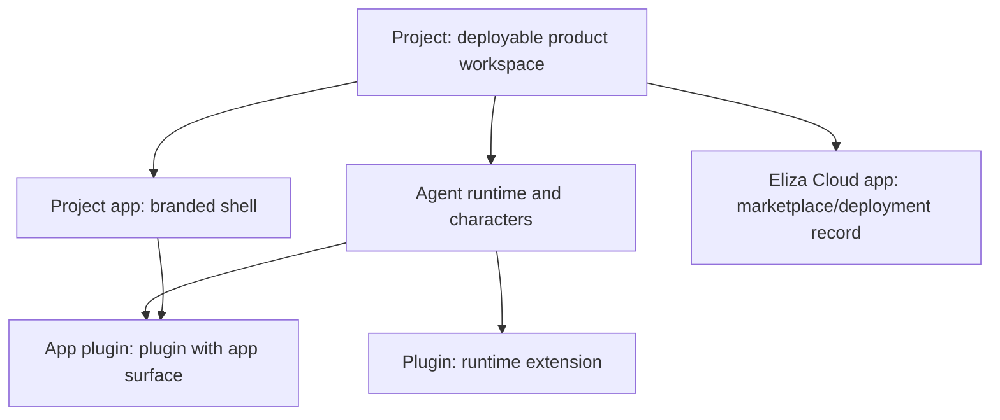

Use these terms consistently when reading or writing elizaOS product docs.

## Terms

| Term | Meaning | Common location |
| --- | --- | --- |
| **Project** | A deployable product workspace, such as Milady. It owns package scripts, app config, agents, plugins, environment, and deployment settings. | Generated workspace root |
| **Plugin** | A runtime extension that adds capabilities to agents or the runtime. Plugins can provide actions, providers, evaluators, services, routes, models, and events. | Plugin package or workspace package |
| **App plugin** | A plugin that also contributes an app surface. It is still a plugin and may keep a package name such as `@elizaos/app-companion`. | eliza repo `plugins/app-*` |
| **Project app** | The branded shell inside a project. It is the product app users run on web, desktop, or mobile. | Generated project `apps/app` |
| **Eliza Cloud app** | A Cloud-side marketplace, deployment, and monetization record for an app or project. | Eliza Cloud systems and dashboard |

## Relationship Model



## Naming Rules

- Use **project** for the deployable product workspace.
- Use **plugin** for runtime extensions.
- Use **app plugin** for plugins that contribute app surfaces.
- Use **project app** for a generated project's `apps/app` product shell.
- Use **Eliza Cloud app** only for the Cloud marketplace/deployment/monetization record.
- Keep app plugin package names as they exist, such as `@elizaos/app-companion`.

<Note>
  In the eliza repo, top-level app plugins live under `plugins/app-*` and keep package names like `@elizaos/app-*`. Generated projects may still have their own `apps/app` folder as the product app.
</Note>

## Examples

### Generated Project

```bash
my-agent-app/
├── apps/app/       # Project app
├── eliza/          # Local eliza checkout
└── package.json    # Project scripts
```

### eliza Repo App Plugins

```bash
eliza/
└── plugins/
    ├── app-companion/
    ├── app-screenshare/
    └── app-workflow-builder/
```

These are app plugins, and their package names remain `@elizaos/app-*`.

## See Also

<CardGroup cols={2}>
  <Card title="Project Overview" icon="diagram-project" href="/projects/overview">
    Understand generated project structure.
  </Card>
  <Card title="Customize a Generated Project" icon="sliders" href="/projects/customize-generated-project">
    Apply terminology while customizing a project.
  </Card>
</CardGroup>
