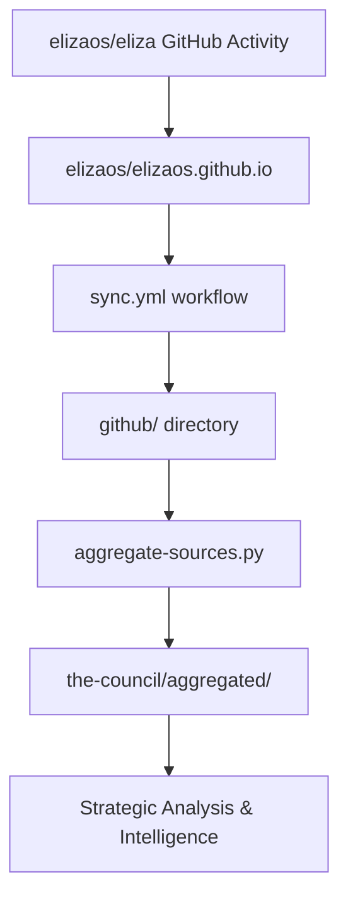

# GitHub Activity Data

**Comprehensive GitHub repository analytics and development tracking.**

This directory contains detailed GitHub activity data, statistics, and summaries for the elizaOS project, providing insights into development patterns, contributor activity, and project health metrics.

## Purpose

The `github/` directory serves as the comprehensive repository for GitHub activity analytics, storing both raw data and processed summaries to track development velocity, contributor engagement, and project evolution over time.

## Directory Structure

### Core Data Storage

#### Raw Database Files (NDJSON Format)
**27 structured data files containing detailed GitHub entity information:**

- `raw_commits.ndjson` - Complete commit history with detailed metadata
- `raw_pull_requests.ndjson` - Pull request data with reviews and status
- `raw_issues.ndjson` - Issue tracking with labels and lifecycle
- `issue_comments.ndjson` - Comment threads and discussions
- `pr_comments.ndjson` - Pull request review comments
- `users.ndjson` - Contributor profiles and activity metrics
- `repositories.ndjson` - Repository metadata and settings
- `labels.ndjson` - Issue and PR labeling system
- `*_reactions.ndjson` - Community engagement metrics
- `*_metadata.json` - Schema and structural information

#### Processed Summaries

##### `summaries/` - Human-Readable Activity Reports
- **`day/`** - Daily activity summaries (297 files, 2024-10-01 to present)
  - Format: `YYYY-MM-DD.md`
  - Content: Daily technical developments, PR status, issue resolution
  - Usage: Daily briefings and immediate activity tracking
  
- **`week/`** - Weekly consolidated reports (43 files)
  - Format: `YYYY-MM-DD.md` (Sunday start dates)
  - Content: Weekly development themes, major accomplishments, trend analysis
  - Usage: Strategic planning and weekly reviews
  
- **`month/`** - Monthly strategic summaries (10 files)
  - Format: `YYYY-MM-01.md`
  - Content: Monthly objectives, major releases, contributor highlights
  - Usage: Executive reporting and quarterly planning

##### `stats/` - Quantitative Analytics
- **`day/`** - Daily statistics (388 files, 2024-07-01 to present)
  - Format: `stats_YYYY-MM-DD.json`
  - Content: Numerical metrics, contributor counts, activity volumes
  - Usage: Trend analysis and performance metrics
  
- **`week/`** - Weekly statistical aggregations (53 files)
  - Format: `stats_YYYY-MM-DD.json`
  - Content: Weekly totals, velocity measurements, team productivity
  - Usage: Sprint reviews and development velocity tracking
  
- **`month/`** - Monthly analytics (13 files, 2024-07 to present)
  - Format: `stats_YYYY-MM.json`
  - Content: Monthly growth metrics, long-term trends, strategic KPIs
  - Usage: Strategic planning and investor reporting

### Meta Directory
- **`meta/`** - System metadata and configuration files
- **`_journal.json`** - Activity logging and processing history

## Data Characteristics

### Coverage Timeline  
- **Daily Summaries**: October 2024 to present (9+ months)
- **Statistical Data**: July 2024 to present (12+ months)
- **Comprehensive Coverage**: 700+ total processed files
- **Growth Rate**: ~3 files per day (daily stats + summaries)

### Content Types

#### Daily Summaries (`summaries/day/`)
- **Technical Developments**: Code changes, architectural decisions
- **Pull Request Tracking**: New PRs, merges, review status
- **Issue Management**: New issues, closures, active discussions
- **Contributor Activity**: Individual and team contributions
- **Release Notes**: Version updates and feature announcements

#### Statistical Data (`stats/`)
- **Activity Metrics**: Commits, PRs, issues, comments per timeframe
- **Contributor Analytics**: Active contributors, new joiners, retention
- **Repository Health**: Code churn, merge rates, issue resolution times
- **Engagement Metrics**: Community participation, review patterns
- **Trend Analysis**: Growth patterns, seasonal variations

### Data Volume Analysis
- **Total Files**: 900+ files across all categories
- **Raw Database**: 27 NDJSON files (~50MB structured data)
- **Processed Summaries**: 350+ markdown files
- **Statistical Reports**: 450+ JSON analytics files
- **Storage**: Approximately 100-150MB total

## Data Sources & Processing

### External Synchronization
- **Source Repository**: `elizaos/elizaos.github.io`
- **Sync Schedule**: Daily at 01:00 UTC via `.github/workflows/sync.yml`
- **Sync Method**: `rsync` from external GitHub activity logs
- **Processing**: Automated aggregation and summary generation

### Integration with Knowledge Pipeline

#### Data Flow


#### Processing Integration
- **Primary Consumer**: `scripts/aggregate-sources.py`
- **Data Keys**: `github_summaries_day`, `github_summaries_week`, `github_stats_month`
- **Processing Schedule**: Daily aggregation at 01:30 UTC
- **Output**: Integrated into `the-council/aggregated/YYYY-MM-DD.json`

#### HackMD Integration
- **Daily Summaries**: https://hackmd.io/saYmg_CxTKCFqyYiWTun2Q (github/summaries/day/)
- **Weekly Reports**: https://hackmd.io/dfDRMJEtQ5WZMIfbv6WXWw (github/summaries/week/)
- **Monthly Analytics**: https://hackmd.io/tEydInvFSaeCPtuPzsuIfg (github/summaries/month/)
- **Configuration**: Managed via `book.json` CUSTOM_HEADER_LINKS
- **Sync Method**: Direct file sync from respective directories

## Content Categories

### Development Activity Tracking
- **Code Contributions**: Commit patterns, code quality metrics
- **Pull Request Lifecycle**: Creation, review, merge patterns
- **Issue Management**: Bug reports, feature requests, resolution tracking
- **Release Management**: Version planning, deployment tracking
- **Code Review Process**: Review quality, approval patterns, feedback loops

### Community Analytics
- **Contributor Growth**: New contributors, retention rates, activity levels
- **Engagement Patterns**: Comment participation, reaction usage, discussion quality
- **Collaboration Metrics**: Cross-team contributions, mentorship activities
- **Community Health**: Response times, issue resolution, support quality

### Project Health Metrics
- **Development Velocity**: Sprint completion, feature delivery rates
- **Technical Debt**: Code quality trends, refactoring activities
- **Stability Indicators**: Bug report rates, regression tracking
- **Documentation Coverage**: README updates, API documentation
- **Testing Coverage**: Test additions, CI/CD improvements

## Usage Examples

### Access Recent Activity
```bash
# View latest daily summary
cat github/summaries/day/$(ls github/summaries/day/ | sort | tail -1)

# Check weekly development trends
cat github/summaries/week/$(ls github/summaries/week/ | sort | tail -1)

# Review monthly statistics
cat github/stats/month/$(ls github/stats/month/ | sort | tail -1)
```

### Analytics & Reporting
```bash
# Search for specific technical topics
grep -r "migration" github/summaries/day/ | tail -10
grep -r "plugin" github/summaries/day/ | head -5

# Track contributor activity
grep -r "contributor" github/summaries/week/ | wc -l

# Monitor issue resolution patterns
find github/summaries/day/ -name "2025-07-*.md" -exec grep -l "CLOSED" {} \;
```

### Statistical Analysis
```bash
# Count daily summary files
ls github/summaries/day/ | wc -l

# Find busiest development periods
ls -la github/stats/day/ | tail -20

# Track long-term trends
ls github/stats/month/ | sort
```

## Data Quality & Validation

### Content Standards
- **Completeness**: Daily coverage with minimal gaps since October 2024
- **Accuracy**: Automated processing with manual quality reviews
- **Consistency**: Standardized markdown and JSON schemas
- **Timeliness**: 24-hour processing latency maximum

### Quality Metrics
- **Data Freshness**: Files updated within 24 hours
- **Schema Compliance**: JSON structure validation
- **Content Integrity**: Link verification and reference checking
- **Historical Continuity**: No missing dates in critical periods

## Key Insights & Patterns

### Development Trends
- **High Activity Periods**: Daily averages of 2-5 PRs, 3-8 issues
- **Contributor Growth**: Expanding active contributor base
- **Release Velocity**: Regular feature releases and stability improvements
- **Technical Focus**: Plugin architecture, CLI improvements, documentation

### Community Health Indicators
- **Response Times**: Quick issue acknowledgment and resolution
- **Review Quality**: Thorough code review processes
- **Documentation**: Comprehensive guides and API references
- **Support**: Active community engagement and troubleshooting

## Troubleshooting

### Common Issues
- **Sync Failures**: Check elizaos/elizaos.github.io repository status
- **Missing Data**: Verify sync.yml workflow completion
- **Processing Delays**: Monitor aggregate-sources.py execution
- **Format Inconsistencies**: Validate markdown and JSON structure

### Data Recovery
- **Manual Sync**: Trigger sync.yml workflow manually
- **Historical Data**: Access archived versions from git history
- **Schema Validation**: Use automated tools to verify data integrity
- **Processing Logs**: Review GitHub Actions workflow logs

## Integration Points

### Automated Processing
- **Daily Aggregation**: Feeds into the-council/aggregated/ pipeline
- **Strategic Analysis**: Input for council briefings and facts extraction
- **Visual Content**: Source data for poster generation
- **Community Updates**: Discord briefings and community communications

### Strategic Planning
- **Development Planning**: Sprint planning and resource allocation
- **Community Growth**: Contributor onboarding and retention strategies
- **Technical Roadmap**: Feature prioritization and architecture decisions
- **Performance Monitoring**: Development velocity and quality metrics

---

*This directory is automatically synchronized from elizaos/elizaos.github.io. Local modifications will be overwritten during the next sync cycle.*