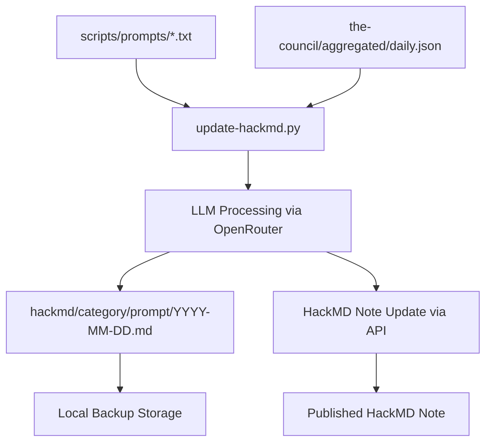

# HackMD Generated Content

**Local backups and organization of LLM-generated content for HackMD notes.**

This directory serves as the local repository for all content generated by the elizaOS knowledge system and synchronized with HackMD collaborative documentation platform.

## Purpose

The `hackmd/` directory provides local version control and organization for content that is automatically generated by LLM prompts and published to HackMD notes. It serves as both a backup system and a way to track the evolution of generated content over time.

## Directory Structure

### Content Categories

#### `comms/` - Communication & Outreach
**LLM-generated content for community communication**
- `discord-announcement/` - Weekly Discord announcements and updates
- `elizaos-tweets/` - Twitter content and social media posts  
- `user-feedback/` - Community feedback analysis and responses
- `weekly-newsletter/` - Newsletter content and summaries

#### `dev/` - Development & Technical
**LLM-generated content for technical documentation**
- `developer-update/` - Technical development progress reports
- `issue-triage/` - GitHub issue analysis and prioritization

#### `strategy/` - Strategic Analysis  
**LLM-generated content for strategic planning**
- `intel/` - Strategic intelligence reports and data analysis

#### `council/` - Council Briefings
**Strategic briefings generated from council context data**
- Daily strategic briefings (2025-04-18 to present)
- Markdown versions of council briefing JSON data

#### `facts/` - Daily Facts
**Daily intelligence briefings in markdown format**
- Daily fact summaries (2025-04-01 to present)
- Markdown versions of extracted facts JSON data

## File Organization

### Naming Conventions
- **Daily Files**: `YYYY-MM-DD.md` and `YYYY-MM-DD.json`
- **Prompt-based Content**: Organized by prompt name (e.g., `discord-announcement/`, `developer-update/`)
- **Generated Content**: Both `.md` (markdown) and `.json` (structured data) formats

### File Types

#### `.md` Files (Markdown Content)
- Human-readable content ready for HackMD publication
- Generated by LLM processing of aggregated data
- Updated daily via `update-hackmd.py`

#### `.json` Files (Structured Data)
- Machine-readable content with metadata
- Contains generation timestamps, prompt information, and structured data
- Optional output when using `-j` flag with `update-hackmd.py`

## Integration with HackMD

### Configuration Management
- **`book.json`** (root level) - Configuration file mapping local prompts to HackMD note IDs
- Contains note IDs, update strategies, and source directory mappings
- Managed by `create-hackmd.py` and `update-hackmd.py`

### Content Generation Pipeline



### HackMD Note Management
- **Creation**: `create-hackmd.py` creates new notes and updates `book.json`
- **Updates**: `update-hackmd.py` generates daily content and syncs to HackMD
- **Permissions**: Notes set to read: guest, write: signed_in

## Data Sources & Processing

### Input Sources
- **Aggregated Daily Data**: `the-council/aggregated/YYYY-MM-DD.json`
- **Prompt Templates**: `scripts/prompts/[category]/[prompt-name].txt`
- **Council Context**: Strategic briefings from `the-council/council_briefing/`
- **Facts Data**: Intelligence reports from `the-council/facts/`

### LLM Processing
- **API**: OpenRouter with `anthropic/claude-3.7-sonnet` (configurable)
- **Context**: Full aggregated daily data + specific prompt templates
- **Output**: Structured analysis, summaries, and strategic insights

## Content Categories Explained

### Communication Content (`comms/`)
- **Discord Announcements**: Weekly community updates with development highlights
- **Twitter Content**: Social media posts and engagement content
- **User Feedback**: Analysis of community sentiment and responses
- **Newsletter**: Comprehensive weekly summaries for stakeholders

### Development Content (`dev/`)
- **Developer Updates**: Technical progress reports and feature announcements
- **Issue Triage**: Analysis and prioritization of GitHub issues and PRs

### Strategic Content (`strategy/`)
- **Intelligence Reports**: Deep analysis of development trends, user experience patterns, and strategic recommendations
- **Data Pattern Analysis**: Metrics, trends, and actionable insights

## GitHub Actions Integration

### Automated Workflows
- **`update_hackmd_notes.yml`** (02:30 UTC) - Daily content generation and HackMD sync
- **Dependencies**: Runs after data aggregation and fact extraction
- **Environment Variables**: `OPENROUTER_API_KEY`, `HMD_API_ACCESS_TOKEN`

### Content Sync Process
1. **Prompt Processing**: Read prompt templates from `scripts/prompts/`
2. **Data Integration**: Load latest aggregated data
3. **LLM Generation**: Process prompts with daily context
4. **Local Storage**: Save generated content to appropriate subdirectories
5. **HackMD Upload**: Update corresponding HackMD notes via API
6. **Book Index**: Update main book index with links to all notes

## Usage Examples

### View Latest Generated Content
```bash
# Latest strategic intelligence
cat hackmd/strategy/intel/$(ls hackmd/strategy/intel/*.md | tail -1)

# Latest Discord announcement
cat hackmd/comms/discord-announcement/$(ls hackmd/comms/discord-announcement/*.md | tail -1)

# Latest developer update
cat hackmd/dev/developer-update/$(ls hackmd/dev/developer-update/*.md | tail -1)
```

### Manual Content Generation
```bash
# Generate content for specific date
python scripts/update-hackmd.py -d 2025-07-24 -j -v

# Create new HackMD notes for all prompts
python scripts/create-hackmd.py -b your-book-permalink -v
```

## File Structure Example

```
hackmd/
├── comms/
│   ├── discord-announcement/
│   │   ├── 2025-07-24.md
│   │   ├── 2025-07-24.json
│   │   └── ...
│   ├── elizaos-tweets/
│   ├── user-feedback/
│   └── weekly-newsletter/
├── dev/
│   ├── developer-update/
│   └── issue-triage/
├── strategy/
│   └── intel/
├── council/
│   ├── 2025-07-24.md
│   └── ...
└── facts/
    ├── 2025-07-24.md
    └── ...
```

## Environment Variables

### Required for Content Generation
- **`OPENROUTER_API_KEY`** - For LLM API calls
- **`HMD_API_ACCESS_TOKEN`** or **`HACKMD_API_TOKEN`** - For HackMD API access

### Optional Configuration
- Model selection and API parameters configurable in scripts
- Default model: `anthropic/claude-3.7-sonnet`

## Data Retention & Archive

- **Active Period**: Current month files
- **Historical Preservation**: All generated content preserved indefinitely
- **Growth Rate**: ~10-20MB per month
- **Backup Strategy**: Local storage serves as primary backup for published HackMD content

## Troubleshooting

### Common Issues
- **Missing Content**: Check if daily aggregation workflow completed
- **API Failures**: Verify HackMD API tokens and OpenRouter API key
- **Empty Generation**: Ensure aggregated data contains sufficient content
- **Permission Errors**: Verify HackMD note permissions and API access

### Content Validation
- Generated markdown should be well-formatted and comprehensive
- JSON files should contain valid structured data
- HackMD notes should reflect latest local content

---

*This directory is automatically managed by the elizaOS knowledge pipeline. Generated content should not be manually edited as it will be overwritten by the next automated run.*