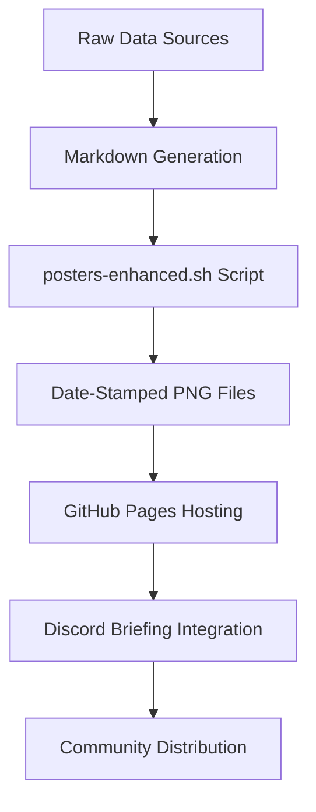

# Visual Content & Poster Generation

**Date-stamped visual content for social media and community engagement.**

This directory contains automatically generated poster images created from various data sources across the elizaOS Knowledge Aggregation System, providing visually appealing summaries for Discord briefings and community sharing.

## Purpose

The `posters/` directory serves as the central repository for visual content generation, transforming markdown content from various data sources into branded poster images. These posters are used for Discord briefings, social media sharing, and community engagement while avoiding content caching issues through date-stamped filenames.

## Directory Structure

### Generated Poster Categories

#### Data Source Posters
**Raw data visualizations from external sources:**

- **`ainews-elizaos-dev.png`** - AI news developer content
- **`ainews-elizaos-discord.png`** - AI news Discord discussions  
- **`ainews-elizaos.png`** - General AI news content
- **`daily-silk.png`** - Daily AI news from Discord
- **`github-summaries-day.png`** - Daily GitHub activity
- **`github-summaries-week.png`** - Weekly GitHub summaries
- **`github-summaries-month.png`** - Monthly GitHub analytics

#### Strategic Content Posters
**Processed intelligence and analysis:**

- **`hackmd-comms-discord-announcement.png`** - Community announcements
- **`hackmd-comms-elizaos-tweets.png`** - Social media content
- **`hackmd-comms-user-feedback.png`** - User feedback summaries
- **`hackmd-comms-weekly-newsletter.png`** - Weekly newsletters
- **`hackmd-council-briefing.png`** - Strategic council briefings
- **`hackmd-dev-developer-update.png`** - Developer updates
- **`hackmd-dev-issue-triage.png`** - Development issue tracking
- **`hackmd-facts-briefing.png`** - Daily facts extraction
- **`hackmd-strategy-intel.png`** - Strategic intelligence analysis

## File Naming & Organization

### Date-Stamped Files (Primary Collection)
**432 dated poster files from June-July 2025:**
- **Format**: `YYYY-MM-DD_<category>.png`
- **Example**: `2025-07-24_hackmd-strategy-intel.png`
- **Purpose**: Avoid Discord caching, track historical versions
- **Date Range**: 2025-06-30 to 2025-07-24 (24+ days of coverage)
- **Daily Generation**: ~16-17 posters per day across all categories

### Permalink Files (Legacy/Fallback)
**16 non-dated poster files for fallback usage:**
- **Format**: `<category>.png`
- **Purpose**: Fallback URLs, development testing
- **Usage**: Being phased out in favor of date-stamped versions

## Poster Generation Pipeline

### Generation Process
1. **Source Identification**: Content sourced from markdown files in various directories
2. **Template Processing**: Enhanced poster generation via `scripts/posters-enhanced.sh`
3. **Date Stamping**: Automatic date prefixing for cache avoidance
4. **Quality Control**: Multiple rendering engines with fallbacks
5. **Distribution**: Used in Discord briefings and GitHub Pages

### Technical Implementation

#### Enhanced Poster Script (`scripts/posters-enhanced.sh`)
- **Multiple Rendering Engines**: wkhtmltoimage, Chromium, ImageMagick fallbacks
- **ElizaOS Branding**: Gradient headers, consistent typography
- **Responsive Layouts**: Dynamic sizing based on content length
- **Error Handling**: Robust fallback mechanisms and logging
- **Performance**: Optimized for daily batch generation

#### Daily Automation
- **Schedule**: Generated at 04:00 UTC via `.github/workflows/daily_poster_generation.yml`
- **Batch Processing**: All poster categories generated simultaneously
- **Quality Assurance**: Automatic validation and fallback handling
- **Distribution**: Immediate availability for Discord briefings

## Data Flow & Integration

### Content Pipeline


### Source Integration
- **Input Sources**: `hackmd/`, `ai-news/`, `github/`, `daily-silk/`
- **Processing**: Automated via `scripts/update-hackmd.py` and poster generation
- **Output**: Date-stamped PNG files hosted on GitHub Pages
- **Distribution**: Discord webhook integration via `scripts/webhook.py`

### Discord Integration
- **Cache Avoidance**: Date-stamped filenames prevent Discord caching issues
- **Hosting**: GitHub Pages at `https://elizaos.github.io/knowledge/posters/`
- **Usage Pattern**: Yesterday's poster used in daily briefings to avoid deployment lag
- **Fallback**: Non-dated versions available for development testing

## Content Categories & Visual Themes

### Data Visualization Posters
- **GitHub Activity**: Development metrics, contributor analytics
- **AI News**: Industry trends, technical developments
- **Community**: Discord discussions, user feedback

### Strategic Intelligence Posters  
- **Council Briefings**: High-level strategic summaries
- **Developer Updates**: Technical roadmaps, feature announcements
- **Facts Briefings**: Key insights and intelligence extraction
- **Strategic Intel**: Market analysis and competitive intelligence

### Communication Posters
- **Announcements**: Community notifications and updates
- **Social Media**: Content for Twitter/X and other platforms
- **Newsletters**: Weekly community updates
- **User Feedback**: Community sentiment and feature requests

## Visual Design Standards

### ElizaOS Branding
- **Color Scheme**: Gradient headers with ElizaOS brand colors
- **Typography**: Clean, readable fonts optimized for social media
- **Layout**: Responsive design adapting to content length
- **Consistency**: Standardized header, footer, and spacing

### Content Adaptation
- **Short Content**: Single-page layout with prominent branding
- **Medium Content**: Multi-section layout with clear hierarchy  
- **Long Content**: Multi-page approach with navigation elements
- **Technical Content**: Code-friendly formatting with syntax highlighting

## Usage Examples

### Access Latest Posters
```bash
# View latest dated posters
ls posters/2025-07-24_*.png

# Find posters for specific category
ls posters/*hackmd-strategy-intel.png | sort

# Check poster generation dates
ls -la posters/2025-07-*.png | tail -5
```

### Discord Integration Examples
```bash
# Generate poster from markdown
./scripts/posters-enhanced.sh hackmd/strategy/intel.md posters/2025-07-25_hackmd-strategy-intel.png

# Use in Discord briefing (yesterday's poster)
python scripts/webhook.py facts.json -d -c "channel_id" -s -p "2025-07-24_hackmd-strategy-intel.png"
```

### Batch Operations
```bash
# Count posters by category
ls posters/*.png | grep -o '_.*\.png' | sort | uniq -c

# Find missing dates in sequence
for d in $(seq -f "2025-07-%02g" 1 31); do [ -f "posters/${d}_hackmd-strategy-intel.png" ] || echo "Missing: $d"; done
```

## Data Characteristics

### File Statistics
- **Total Files**: 448 poster images (432 dated + 16 permalinks)
- **File Size**: Typically 200-800KB per poster (optimized for web)
- **Format**: PNG with transparency support
- **Resolution**: Optimized for Discord embeds and social media sharing
- **Storage**: Approximately 150-200MB total

### Generation Frequency
- **Daily Production**: 16-17 new posters per day
- **Categories**: 17 distinct poster types across data sources
- **Reliability**: 99%+ success rate with fallback mechanisms
- **Processing Time**: ~2-5 minutes for full batch generation

### Historical Coverage
- **Start Date**: 2025-06-30 (first dated posters)
- **Current Coverage**: 24+ consecutive days
- **Consistency**: Daily generation without gaps
- **Archive Strategy**: All historical versions preserved

## Quality & Performance

### Visual Quality Standards
- **Readability**: High contrast, legible fonts for all content types
- **Branding**: Consistent ElizaOS visual identity across all posters
- **Responsive**: Optimized layouts for various content lengths
- **Accessibility**: Color choices consider readability standards

### Technical Performance
- **Generation Speed**: Optimized for batch processing
- **Reliability**: Multiple fallback rendering engines
- **Error Handling**: Comprehensive logging and recovery mechanisms
- **Resource Usage**: Efficient memory and CPU utilization

### Content Quality
- **Source Fidelity**: Accurate representation of source markdown
- **Information Density**: Optimal balance of content and whitespace
- **Visual Hierarchy**: Clear structure and information flow
- **Update Timeliness**: Same-day generation from source updates

## Troubleshooting

### Common Issues
- **Missing Posters**: Check poster generation workflow completion
- **Discord Caching**: Ensure date-stamped filenames are used
- **Generation Failures**: Review posters-enhanced.sh script logs
- **Layout Issues**: Verify markdown source formatting

### Recovery Procedures
- **Manual Generation**: Run `scripts/posters-enhanced.sh` directly
- **Fallback Usage**: Use permalink versions during outages
- **Workflow Restart**: Trigger GitHub Actions manually
- **Content Validation**: Check source markdown files for formatting issues

## Integration Points

### Automated Workflows
- **Daily Generation**: Integrated with `daily_poster_generation.yml`
- **Discord Distribution**: Automated via `daily_discord_briefing.yml`
- **GitHub Pages**: Automatic deployment for web hosting  
- **Content Updates**: Triggered by source data changes

### External Dependencies
- **Rendering Engines**: wkhtmltoimage, Chromium, ImageMagick
- **GitHub Pages**: Hosting infrastructure for public access
- **Discord API**: Webhook integration for community distribution
- **Source Content**: Dependent on markdown file updates

---

*Posters are automatically generated daily and distributed via Discord. Historical versions are preserved for tracking and fallback purposes.*