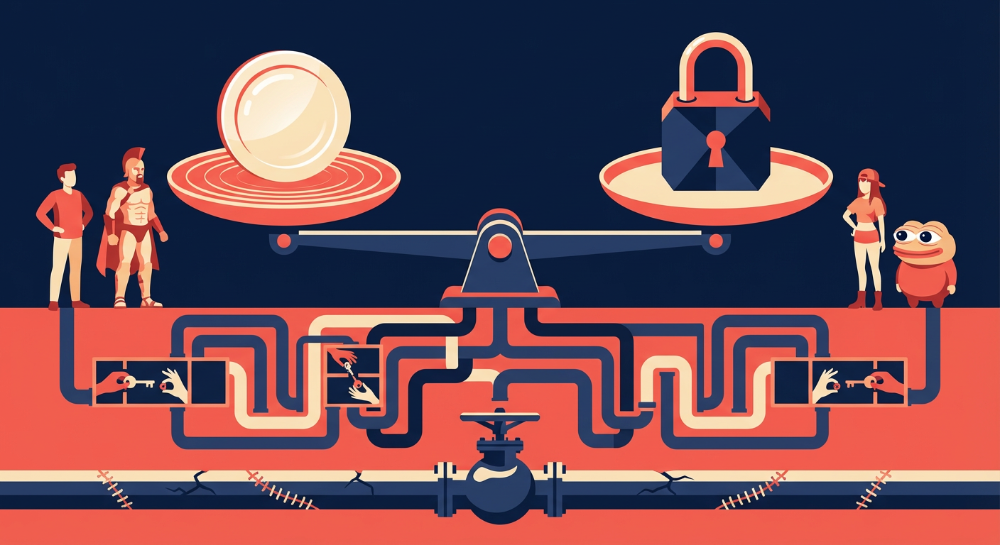
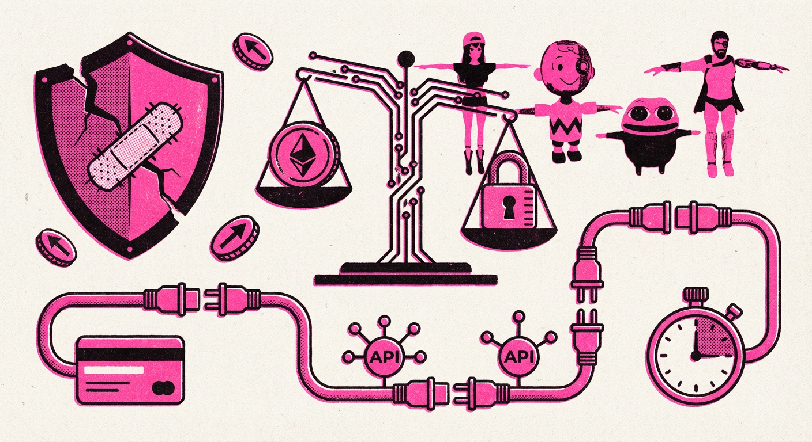
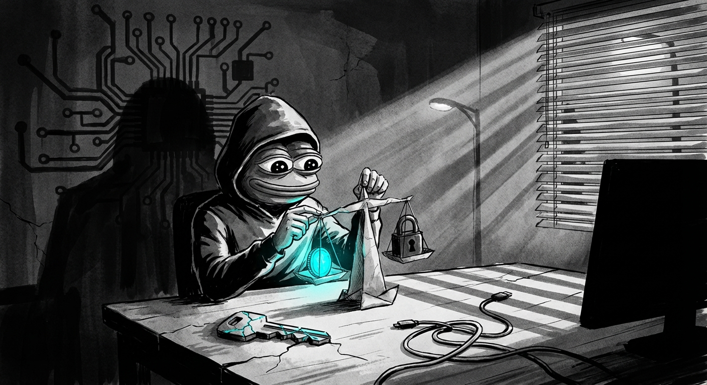
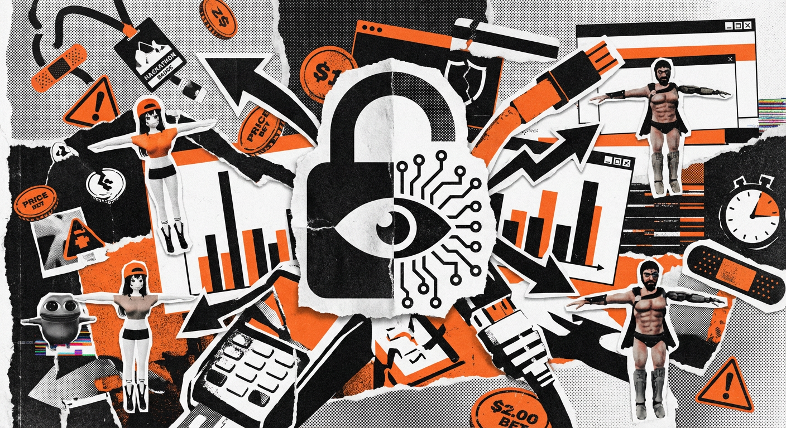
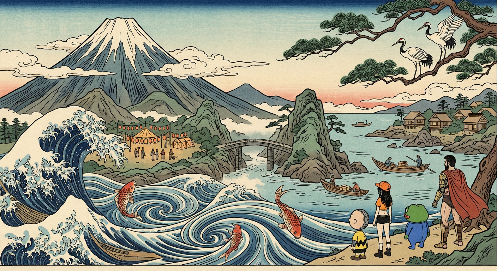
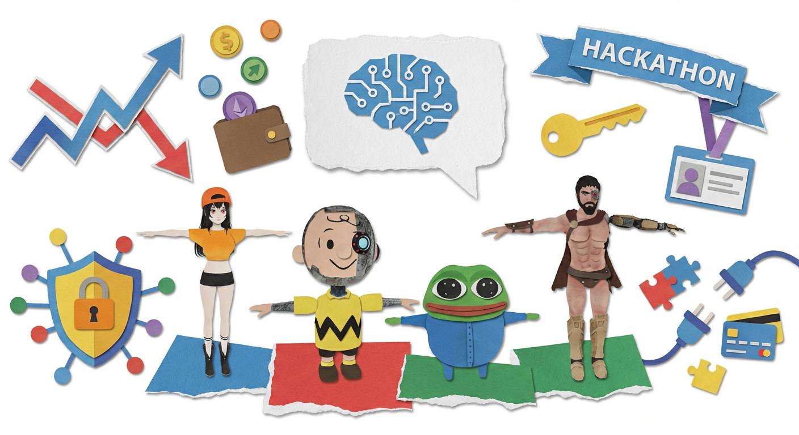

# Style Sampler: 2025-12-13

Generated: 2025-12-13 20:10:12

---

## Source Facts

### Overall Summary

> ElizaOS community focused heavily on prediction markets and price betting mechanisms while developers addressed critical security vulnerabilities and implemented major authentication improvements. Technical discussions centered around hackathon opportunities and integration challenges with various APIs and payment systems.

### Category Highlights

**github_updates:**
- Development focused on stabilization, security improvements, and cloud integration with emphasis on authentication systems and code quality cleanup....

**discord_updates:**
- Users initiated prediction markets for ElizaOS token price betting, with DorianD proposing bets on whether ElizaOS would be above/below $0.01 by NYE. Discussion included time decay algorithms for bett...
- Technical discussions focused on Twitter agent API consumption issues, data pipeline fixes for elizaOS/knowledge repository, and guidance on integrating x402 payment capabilities. Users also discussed...

**user_feedback:**
- Korean users experiencing significant problems with ELIZA token migration on Bithumb exchange, with team waiting on exchange response....
- Users reported foreign key constraint errors with plugin-sql and plugin-twitter components when creating memories....

**strategic_insights:**
- Users are organically creating prediction markets around ElizaOS token price, suggesting strong community engagement and potential for gamification features....
- Critical security issue discovered where server doesn't require authentication tokens, allowing attackers to extract secrets via API endpoints....

**market_analysis:**
- Sapience x elizaOS hackathon announced with $10,000 prize from Arbitrum DAO, focusing on building prediction market agents....
- Users expressing concerns about ElizaOS token price movements in relation to migration activities and questioning token burn mechanisms....

---

## Generated Images

### editorial

**Description:** Conceptual New Yorker/Monocle style with bold shapes and visual metaphors



<details>
<summary>View Prompt</summary>

```
editorial illustration, conceptual art, flat design, a sleek mechanical balance scale where one side holds a polished, glossy coin-shaped weight and the other side holds a faceted padlock-shaped weight; beneath the scale, a maze-like network of pipes routes toward a single guarded valve, with tiny simplified hands swapping detachable keys between compartments to suggest upgraded authentication; subtle cracks patched with stitched seams across the base imply security fixes, while a faint ripple of concentric circles around the coin hints at speculative betting without depicting any interfaces, bold shapes, 2D flat composition, sophisticated layout, limited palette of deep navy, coral red, and warm cream, vector art aesthetic, visible stylization, hand-crafted feel. A wordless visual metaphor. No typography, no letters, no numbers, no logos, no UI.
```

</details>

**Characters used:** eliza, marc, peepo, spartan

---

### risograph

**Description:** Textured screen print with halftone dots, grain, and 2-3 color separation



<details>
<summary>View Prompt</summary>

```
risograph print, screen print illustration, halftone texture, bold simplified scene of a balance scale made from circuit traces weighing a coin and a padlock, a cracked shield being patched with a stitched bandage, a winding pipeline of plug-and-socket connectors linking payment card icon, API nodes, and a hackathon stopwatch, small abstract market arrows orbiting like tokens, high-contrast geometric silhouettes, two-color print in fluorescent pink and black, visible halftone dots, grain texture, paper texture, slight misregistration, vintage print aesthetic, bold graphic shapes, 2D flat Purely visual symbolism. No typography, no letters, no readable marks.
```

</details>

**Characters used:** eliza, marc, peepo, spartan

---

### noir_ink

**Description:** High-contrast ink illustration with dramatic lighting and paper texture



<details>
<summary>View Prompt</summary>

```
ink wash illustration, noir style, brush and ink, a lone hooded figure at a dim desk sculpting a fragile paper origami balance scale where one side holds a single glowing coin and the other a padlock, a looming shadow behind them shaped like a circuit board, with three supporting elements: a cracked authentication key on the tabletop, a tangled cable snaking toward a blank terminal silhouette, and a distant streetlamp beam cutting through window blinds, high contrast shadows, visible brush strokes, paper grain texture, black and white with a subtle electric cyan accent, hand-drawn aesthetic, imperfect linework, atmospheric mood, Wordless noir scene. No text, no signs, no readable elements.
```

</details>

**Characters used:** eliza, marc, peepo, spartan

---

### collage

**Description:** Punk mixed-media aesthetic with halftone, torn paper, and glitch textures



<details>
<summary>View Prompt</summary>

```
brutalist collage, mixed media illustration, torn paper texture, central torn-paper silhouette of a padlock fused with a circuit board and an eye (authentication + AI), surrounded by jagged cutout arrows and fragmented bar charts like prediction-market odds, scattered coin and token shapes stamped like price bets, layered API connector plugs and cable diagrams colliding with payment terminal fragments, broken shield icons and patchwork bandage motifs implying security fixes, hackathon energy suggested by clipped badges, lanyard shapes, and sprinting stopwatch shards, interlaced with angular UI windows and warning triangles ripped into the background, heavy use of overlapping paper scraps forming a clear focal lock-eye at center, halftone patterns, xerox grain, glitch artifacts, rough edges, black and white with safety orange, punk zine aesthetic, chaotic composition, visible texture layers. Abstract visual chaos. No readable text, no logos, no legible symbols.
```

</details>

**Characters used:** eliza, marc, peepo, spartan

---

### ukiyo_e

**Description:** Ukiyo-e style with bold outlines, flat colors, and wave/cloud patterns



<details>
<summary>View Prompt</summary>

```
ukiyo-e illustration, Japanese woodblock print style, towering mountains representing secure system foundations and fortified authentication gates, sweeping ocean waves and curling currents symbolizing data flow and prediction markets, koi fish leaping through eddies as price bets and volatility, a distant fishing village on rocky shores as the developer community, vigilant cranes perched on pine branches as security auditors spotting vulnerabilities, a narrow stone bridge crossing a misty ravine as API integrations, small boats exchanging cargo across calm inlets as payment system connections, a festival encampment at the mountain base with lantern-lit tents as hackathon energy, bold black outlines, flat color areas, wood grain texture, traditional Japanese clouds, wave patterns, stylized natural elements, Hokusai inspired, Edo period aesthetic, limited traditional palette, Pure visual storytelling. No text, no labels, no modern signage.
```

</details>

**Characters used:** eliza, marc, peepo, spartan

---

### paper_cutout

**Description:** Matisse-inspired cut-paper with layered shapes and tactile texture



<details>
<summary>View Prompt</summary>

```
paper cutout illustration, collage art, layered shapes, a whimsical news bulletin scene built from simple paper metaphors: a large torn-paper speech bubble holding a stylized circuit-brain icon, a stacked set of paper prediction arrows rising and falling like a playful market graph, coin and token circles cut from paper drifting toward a paper wallet, a chunky shield and padlock layered over a small paper network of nodes to symbolize security fixes, a key and ID badge shape to represent authentication upgrades, a ribbon-like hackathon banner shape above scattered puzzle-piece connectors linking to tiny paper API plugs and payment card silhouettes, all arranged on a clean flat background with generous negative space, torn paper edges, visible texture, layered with soft shadows, bold primary colors, Matisse inspired, craft aesthetic, cut paper shapes, tactile handmade feel, children's book style Tactile paper craft. No text, no printed words, no labels.
```

</details>

**Characters used:** eliza, marc, peepo, spartan

---

## Summary

| Style | Status | Characters |
|-------|--------|------------|
| editorial | ✅ | eliza, marc, peepo, spartan |
| risograph | ✅ | eliza, marc, peepo, spartan |
| noir_ink | ✅ | eliza, marc, peepo, spartan |
| collage | ✅ | eliza, marc, peepo, spartan |
| ukiyo_e | ✅ | eliza, marc, peepo, spartan |
| paper_cutout | ✅ | eliza, marc, peepo, spartan |
