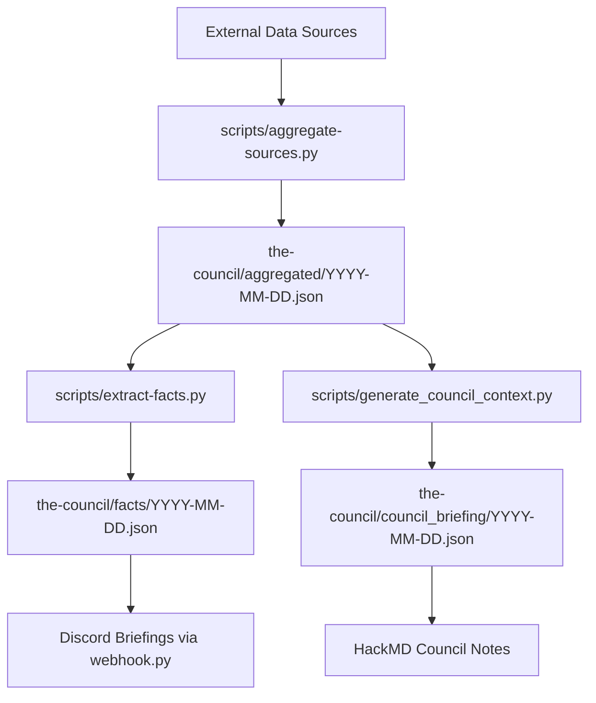

# The Council

**The heart of the elizaOS Knowledge Aggregation System's data processing pipeline.**

This directory contains the processed outputs from the daily automated intelligence pipeline, serving as the central hub for all synthesized knowledge and strategic analysis.

## Purpose

The `the-council/` directory serves as the core data processing center for the elizaOS project's knowledge system. It transforms raw data from multiple sources into actionable intelligence through a series of automated scripts and LLM-powered analysis.

## Directory Structure

### `aggregated/`
**Daily comprehensive data consolidation**
- Contains daily JSON files (`YYYY-MM-DD.json`) generated by `scripts/aggregate-sources.py`
- Each file aggregates data from all external sources: AI news, GitHub activity, Discord discussions, and documentation
- `daily.json` - Permalink to the most recent aggregated file
- **Data Flow**: Raw sources → aggregated comprehensive context
- **Usage**: Primary input for all downstream processing (facts, briefings)

### `facts/`
**Extracted intelligence briefings**
- Contains daily JSON files generated by `scripts/extract-facts.py`
- Structured intelligence reports with categorized insights and sentiment analysis
- Includes source tracing back to original aggregated data via `source_keys`
- `daily.json` - Permalink to the most recent facts file
- **Data Flow**: aggregated → LLM analysis → structured facts
- **Usage**: Primary input for Discord briefings via `webhook.py`

### `council_briefing/`
**Strategic executive summaries**
- Contains daily JSON files generated by `scripts/generate_council_context.py`
- High-level strategic analysis using the north-star prompt and monthly goals
- Designed for leadership-level decision making and strategic planning
- `daily.json` - Permalink to the most recent council briefing
- **Data Flow**: aggregated → strategic LLM analysis → council briefing
- **Usage**: Executive briefings and strategic planning

### `episodes/`
**Processed podcast/episode content**
- Contains JSON files for council episode discussions
- Episode titles cover topics like "The Plugin Revolution", "The Architecture of Intelligence", etc.
- Structured episode content for knowledge integration
- `all_episodes.txt` - Complete list of available episodes

### `old/`
**Archive of deprecated processing results**
- Historical files from previous processing iterations
- Legacy naming conventions (e.g., `council_context_YYYY-MM-DD.json`)
- Preserved for reference and data continuity

## Data Processing Pipeline



## File Formats

### Aggregated Files
- **Format**: JSON with structured keys for each data source
- **Naming**: `YYYY-MM-DD.json`
- **Content**: Raw content from AI news, GitHub activity, Discord, docs
- **Size**: Typically 100KB-500KB per day

### Facts Files
- **Format**: Structured JSON with categorized insights
- **Content**: 
  - `overall_summary` - Executive summary
  - `categories` - Organized by twitter_news, github_updates, discord_updates, user_feedback, strategic_insights
  - `source_keys` - Traceability to aggregated data
- **Sentiment**: Includes sentiment analysis for user feedback

### Council Briefing Files
- **Format**: Strategic analysis JSON
- **Content**: High-level themes, discussion points, strategic recommendations
- **Alignment**: Evaluated against monthly strategic goals and north-star vision

## Integration Points

### GitHub Actions Workflows
- **`aggregate-daily-sources.yml`** (01:30 UTC) - Generates aggregated files
- **`extract_daily_facts.yml`** (01:15 UTC) - Creates facts files
- **`generate-council-briefing.yml`** (02:00 UTC) - Produces council briefings

### Scripts Integration
- **Input Scripts**: `aggregate-sources.py`, `extract-facts.py`, `generate_council_context.py`
- **Output Scripts**: `webhook.py` (uses facts), `update-hackmd.py` (uses briefings)

### Environment Variables Required
- `OPENROUTER_API_KEY` - For LLM processing in facts and briefing generation
- Data flows automatically from GitHub Actions scheduling

## File Naming Conventions

- **Daily Files**: `YYYY-MM-DD.json` (ISO 8601 date format)
- **Permalinks**: `daily.json` (symlink to latest file)
- **Episodes**: `episode-[topic-name].json`

## Usage Examples

### Accessing Latest Data
```bash
# View latest aggregated data
cat the-council/aggregated/daily.json

# View latest facts
cat the-council/facts/daily.json

# View latest strategic briefing
cat the-council/council_briefing/daily.json
```

### Processing Specific Date
```bash
# Process data for specific date
python scripts/extract-facts.py -i the-council/aggregated/2025-07-24.json -o the-council/facts/2025-07-24.json
```

## Data Retention

- **Active Processing**: Current month files
- **Archive Policy**: Historical files preserved indefinitely
- **Storage**: Approximately 50MB/month growth rate
- **Cleanup**: Old processing formats moved to `old/` directory

## Troubleshooting

### Common Issues
- **Missing daily.json**: Check if latest aggregation workflow completed
- **Empty aggregated files**: Verify external data sync workflows
- **LLM processing failures**: Check OpenRouter API key and quota

### Data Validation
- Aggregated files should contain multiple data source keys
- Facts files should include sentiment analysis and source tracing
- Council briefings should align with strategic themes

---

*This directory is automatically managed by the elizaOS knowledge aggregation pipeline. Manual modifications should be coordinated with the automation workflows.*